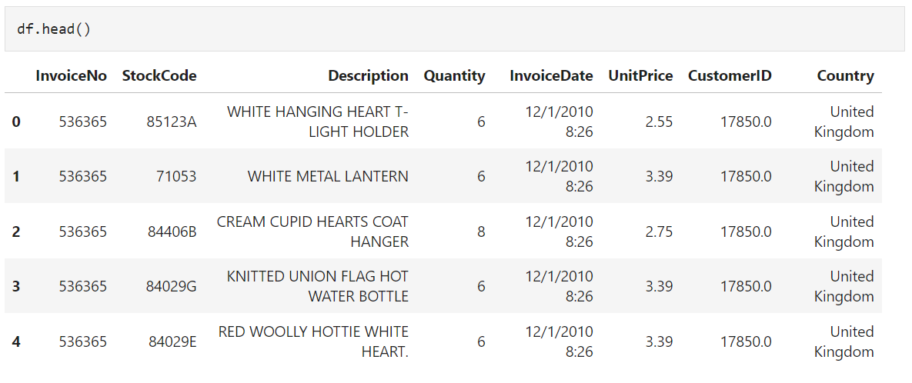
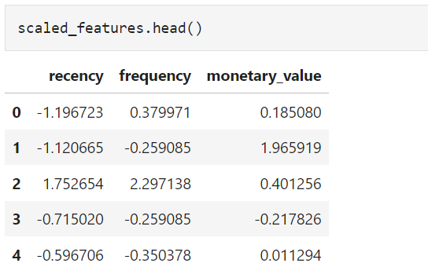
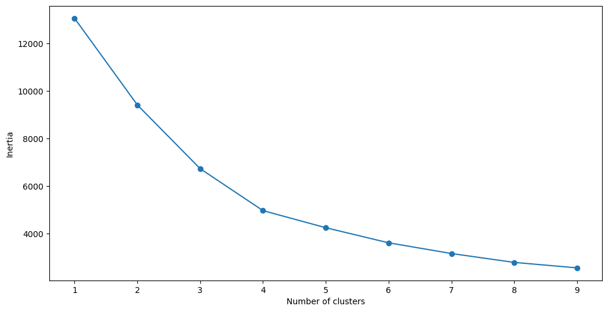
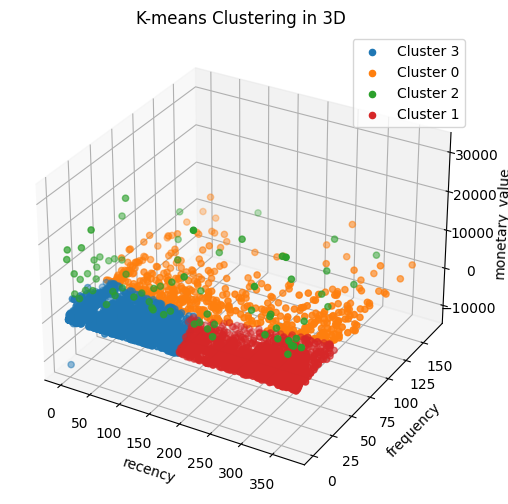

# Customer Segmentation with RFM Analysis
In the ever-evolving landscape of business, understanding and effectively catering to the unique needs of customers is paramount. Customer segmentation, the practice of dividing a customer base into groups with similar traits, allows businesses to tailor their strategies for enhanced customer engagement and satisfaction. This project delves into the realm of customer segmentation using RFM (Recency, Frequency, Monetary) analysis—a powerful method that classifies customers based on their recent purchase behavior, frequency of transactions, and monetary value.  
/illustration/
## Objectives
This project is mainly aiming for two goals:  
* The first goal is to calculate RFM scores for each customers based on their historical purchasing data. The purpose is to analyze customer value and explore the metrics to build the clustering algorithm.
* The second goal is to segment customers into a number of cluster for the strategy development.
## Dataset Description
I used an [E-Commerce Dataset](https://www.kaggle.com/datasets/carrie1/ecommerce-data) from Kaggle that contains transaction information from around 4,000 customers.  
## Data Exploration and Preprocessing
[Notebook for more details](CustomerSegment.ipynb) 
#### Understanding the dataframe: 

The dataframe consists of 8 variables:
* InvoiceNo: The unique identifier of each customer invoice.
* StockCode: The unique identifier of each item in stock.
* Description: The item purchased by the customer.
* Quantity: The number of each item purchased by a customer in a single invoice.
* InvoiceDate: The purchase date.
* UnitPrice: Price of one unit of each item.
* CustomerID: Unique identifier assigned to each user.
* Country: The country from where the purchase was made.  

#### Secondly, calculating RFM scores and standardizing these scores to build the clustering model.
  
RFM is commonly used in marketing to evaluate a client’s value based on their:
* Recency: How recently have they made a purchase?
* Frequency: How often have they bought something?
* Monetary Value: How much money do they spend on average when making purchases?

## Customer Segmentation Methods
In this project, I used **K-Means** clustering algorithm to perform customer segmentation.  
When building a clustering model, we need to decide how many segments we want to group the data into. This is achieved by a heuristic called **the elbow method**.  

The “elbow” of this graph is the point of inflection on the curve, and in this case is at the 4-cluster mark. This means that we will segment customers into 4 different groups.
## Result and Interpretation

* Cluster 2: **High-Value Segment**  
This segment has moderate recency (160.63), moderate frequency (31.60) and high monetary value (10,587.06). These customers have made recent and frequent purchases, and they contribute significantly to revenue.
* Cluster 0: **Potential Loyalists**  
This segment has moderate recency (163.08), high frequency (69.19) and a relatively high monetary value (1,804.55). While not as high in monetary value as High-Value group, these customers are still valuable due to their frequency and recent activity.
* Cluster 1: **At-Risk Customers**  
This cluster has high recency (281.52), low frequency (18.84) and a moderate monetary value (728.42). These customers have not made recent purchases and have a lower frequency, indicating a potential decline in engagement.
* Cluster 3: **Low-Value Segment**  
This segment has low recency (64.79), low frequency (15.06), and a moderate monetary value (568.92). These customers are not active in terms requency, and they contribute less to overall revenue.
